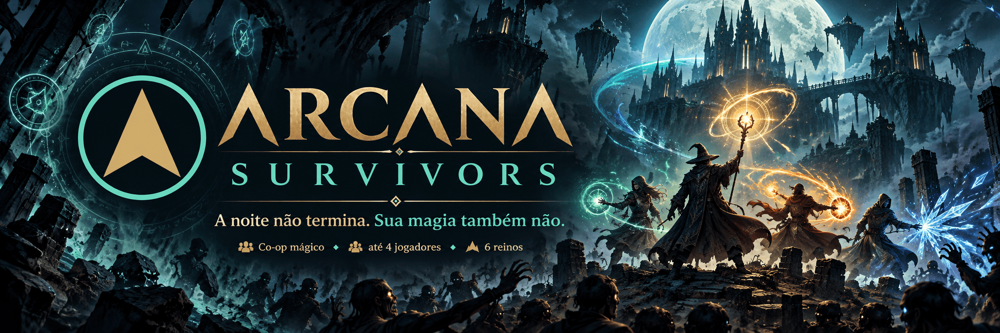

# Arcana Survivors — port nativo em C++



Port em C++20 do **Arcana Survivors** (antes *wizard-coop*, um survivors-like cooperativo feito em
JavaScript) para **Nintendo Switch**, **PS Vita** e **PSP**, com builds para **Windows** e
**Linux** (o mesmo frontend, usado também para desenvolvimento). Os ports em JavaScript (nx.js / QuickJS) tinham quedas grandes de FPS; aqui não há
JavaScript, HTML nem Canvas no jogo: simulação, renderer e áudio são nativos.

**Baixe a versão mais recente em [Releases](https://github.com/MrPowerUp82/wizard-coop-ports/releases/latest).**

## Plataformas

| Plataforma | Arquivo | Instalação | Save |
|---|---|---|---|
| Nintendo Switch (CFW/Atmosphère) | `arcana-survivors-v<versão>-switch.nro` | Copie para `sd:/switch/` e abra pelo Homebrew Menu, de preferência em modo aplicativo (segure R ao abrir um jogo). | `sdmc:/switch/arcana-survivors/profile.ini` |
| PS Vita (HENkaku/Ensō) | `arcana-survivors-v<versão>-vita.vpk` | Instale pelo VitaShell. Title ID `ARCA00001`. | `ux0:data/arcana-survivors/profile.ini` |
| PSP (CFW) ou Vita com Adrenaline | `arcana-survivors-v<versão>-psp.cso` (ou `.iso`) | Copie para `ms0:/ISO/` (no Vita: `ux0:pspemu/ISO/`). Não roda em firmware original. | `ms0:/data/arcana-survivors/profile.ini` |
| Windows 10/11 x86_64 | `arcana-survivors-v<versão>-windows-x86_64.zip` | Extraia a pasta inteira e rode `arcana-survivors.exe`; não precisa instalar nada. O executável não é assinado, então o SmartScreen pode avisar: "Mais informações" → "Executar assim mesmo". | `%APPDATA%\MrPowerUp82\ArcanaSurvivors\profile.ini` |
| Linux x86_64 (dev) | `arcana-survivors-v<versão>-linux-x86_64.tar.gz` | Precisa de `libsdl2`, `libsdl2-image` e `libsdl2-ttf`. Extraia e rode `./arcana_desktop`. | pasta de dados do usuário (o caminho aparece no terminal) |

O save é um arquivo de texto `chave=valor`, gravado de forma atômica (arquivo temporário + rename):
fechar o jogo ou acabar a bateria no meio não corrompe o progresso, e reinstalar não apaga nada.

## O que tem no jogo

- **Campanha completa:** seis reinos com hordas e chefes, rituais rápido, clássico e infinito,
  poderes, evoluções, combos, encontros (altar, mercador, santuário, ladrão), maldições e reviver.
- **Co-op local para até 4 jogadores** em tela compartilhada (Switch, Vita e PC). No Switch, cada
  jogador pode usar um Joy-Con na horizontal, um par de Joy-Cons, o modo portátil ou um Pro Controller.
- **Co-op online no PC (Windows e Linux)**, no mesmo servidor da versão web: dá para jogar junto com
  quem está no navegador. Lista de salas abertas, sala fechada com código, lobby com troca de
  personagem, ritual e maldições, entrada com a partida em andamento e reconexão automática.
  Sinais para os aliados: Q (venham aqui), E (ajuda), X (cuidado), C (olhem ali); no controle,
  segure X/Y e aperte uma direção.
- **Quatro personagens** (Azul, Vermelho, Verde e Roxo), cada um com o próprio tiro e especial, e
  **três desbloqueáveis** (O Desenvolvedor, Guardião da Aurora e The God, abaixo); no co-op ninguém repete
  personagem.
- **Grimório (meta-progressão):** as moedas de cada partida compram os 15 upgrades permanentes do
  jogo web, incluindo os desbloqueios Arsenal (arma inicial), Segundo feitiço (especial alternativo)
  e Ritual infinito. Dá para redistribuir tudo e receber as moedas de volta.
- **Visual do cliente web portado:** chão por fase, atmosfera, poses animadas, efeito de cada
  especial, raios, familiar, números de dano, tremor e flash de tela, avisos de eventos.
- **Áudio sintetizado** como no navegador: 31 efeitos e trilha generativa que muda com o momento da
  partida (menu, horda, guardião, fúria, vitória, derrota). Nenhum arquivo de áudio.

### Personagem secreto: O Desenvolvedor

Na tela de título, aperte **sete vezes** o botão de trocar opções do Jogador 1 (R no teclado, X/Y no
controle, □/△ no Vita e no PSP). O Desenvolvedor entra na seleção de personagem e o desbloqueio fica
salvo no `profile.ini` (`unlock.developer=1`).

Ele tem 5× de vida, 4× de dano, ataques duas vezes mais rápidos, três projéteis iniciais, +35% de
velocidade e 12 de armadura. **Código-fonte** atravessa até seis alvos, desacelera e explode em área.
O visual é um mago ciano com sigilos geométricos girando ao redor e a marca `</>`.

**Reescrever realidade** solta uma onda ciano que atinge inimigos em um raio de 600 unidades com 24× o
dano, apaga projéteis nesse raio, cura 50% da vida máxima e protege por 3 s. A carga se regenera em
10 s, além dos cristais. Com *Segundo feitiço*, **Restauração do sistema** faz uma varredura magenta
que elimina todos os inimigos presentes no mapa no instante da ativação, incluindo elites e chefes,
com abates, dano, drops e progressão de fase normais; inimigos que surgirem depois não são afetados.
Também cura aliados vivos em até 600 unidades em 100% e protege por 5 s. Maldições que reduzem cura
continuam valendo.

### Recompensa do Clássico: Guardião da Aurora

Vença os seis reinos no **Ritual clássico**, solo, co-op local ou online, para desbloquear o
**Guardião da Aurora** para sempre (`unlock.aurora=1`). A tela de resultado anuncia a recompensa e o
personagem entra na seleção na hora. Derrotas, abandonos e os rituais rápido e infinito não contam.

O Guardião usa vestes douradas e uma auréola solar. Tem **150 de vida, +35% de dano, +10% de
velocidade, 3 de armadura e intervalo de ataque 15% menor**, antes das melhorias do Grimório. A
**Lança da aurora** atravessa dois alvos. Sua auréola dispara um raio solar no inimigo mais próximo
em até 280 unidades a cada 5 s, causando 2,5× seu dano. **Alvorada** causa 6× de dano em 300 unidades, apaga
projéteis nesse raio e protege por 1,5 s. Com *Segundo feitiço*, **Coroa da aurora** dispara 12
lanças radiais com 3× de dano. Os especiais carregam com cristais normalmente.

### Personagem comprável: The God

**The God** custa **60.000 moedas** no Grimório e permanece desbloqueado após a redistribuição das
melhorias. Tem 500 de vida, +50% de dano, +20% de velocidade, 12 de armadura, intervalo de ataque
15% menor e disparos que atravessam três inimigos. Dois planetas orbitam e ferem inimigos por
contato, separadamente dos Orbes arcanos. **Big Bang** atinge inimigos em 300 unidades, apaga
projéteis próximos e protege por 1,5 s. O especial alternativo **Constelação** dispara 12 orbes.

Os três personagens funcionam no cooperativo com quem joga no navegador, usando os desbloqueios
salvos no perfil local para entrar no servidor.

## Controles

| Ação | Switch | Joy-Con na horizontal | Vita / PSP | PC |
|---|---|---|---|---|
| Mover | analógico / direcional | analógico | analógico / direcional | WASD / setas |
| Especial | A, R, ZR | SL ou botão da direita | ✕, R | Espaço |
| Esquiva | B, L, ZL | SR ou botão de baixo | ○, L | Shift |
| Trocar opções de poder | X, Y | botões de cima/esquerda | □, △ | R |
| Pausa | + / − | + ou − | Start | Esc |
| Overlay de desempenho | clique do analógico | clique do analógico | Select | F3 |
| Sinais (online) | — | — | — | Q / E / X / C |

No menu, esquerda/direita troca o personagem; no co-op, cada jogador entra com A e sai com B.

## Build

Só é preciso ter o **Docker**: todos os toolchains (devkitPro, VitaSDK, PSPSDK, GCC e MinGW-w64)
rodam em containers, nada é instalado no sistema. O build do Windows é uma compilação cruzada no
Linux do container (MinGW-w64 GCC + os pacotes de desenvolvimento oficiais do SDL2 para MinGW); os
testes rodam no alvo `host`.

**Windows:** dê dois cliques em `build.cmd` ou rode no terminal (sem Git Bash, WSL ou ajuste de
política de execução):

```bat
build.cmd                 :: host, switch, vita
build.cmd windows psp     :: só alguns: host | switch | vita | windows | psp | psp-probe
release.cmd               :: todos os alvos + dist\release\v<versão>\ (arquivos, SHA256SUMS, notas)
```

**Linux / macOS:**

```bash
tools/docker/build-all.sh                  # host, switch, vita
tools/docker/build-all.sh psp              # só alguns alvos
tools/release/make-release.sh              # release
```

| Alvo | Imagem | Saída em `dist/` |
|---|---|---|
| `host` | `arcana-host` (de `tools/docker/host.Dockerfile`) | testes + `linux/arcana_desktop` |
| `switch` | `devkitpro/devkita64` | `switch/arcana-survivors.nro` |
| `vita` | `vitasdk/vitasdk` | `vita/arcana-survivors-native.vpk` |
| `windows` | `arcana-windows` (de `tools/docker/windows.Dockerfile`) | `windows/arcana-survivors.exe` + DLLs do SDL2 + `assets/` |
| `psp` | `pspdev/pspdev` + `arcana-host` | `psp/arcana-survivors.iso`, `.cso` e a pasta `ArcanaSurvivors/` (EBOOT) |
| `psp-probe` | `pspdev/pspdev` | `psp-probe/EBOOT.PBP` (mede a CPU do PSP, sem gráficos) |

O script de release se recusa a rodar com mudanças não commitadas, para que os hashes sempre
correspondam a um commit. As notas de destaque de cada versão ficam em `tools/release/NOTES.md`, e a
versão em `platforms/switch/sdl/Makefile` (`APP_VERSION`).

Ao enviar uma tag `v<versão>` ao GitHub, o workflow de release compila os cinco alvos em jobs
separados, confere os hashes dos pacotes e publica a release com as notas e os arquivos de instalação.

### Build manual (sem Docker)

```bash
cmake -S . -B build -DCMAKE_BUILD_TYPE=Release \
  -DARCANA_BUILD_SERVER=OFF -DARCANA_BUILD_NET=OFF -DARCANA_BUILD_CLIENT=OFF \
  -DARCANA_BUILD_TESTS=ON -DARCANA_BUILD_DESKTOP=ON
cmake --build build -j
ctest --test-dir build --output-on-failure
```

`ARCANA_BUILD_DESKTOP` precisa de SDL2, SDL2_image e SDL2_ttf (via pkg-config; no Windows, via
`find_package` com `CMAKE_PREFIX_PATH` apontando para os pacotes do SDL2, como em `tools/docker/windows-build.sh`). `-DARCANA_REAL_FLOAT=ON` compila a
simulação em `float`, como no PSP, para testá-la no PC.

## Ferramentas de desenvolvimento

O `arcana_desktop` (no Windows, `arcana-survivors.exe`, que herda o terminal de onde é aberto para
mostrar a saída) tem opções para testar sem controle e sem tela:

```bash
./arcana_desktop --autoplay 4 --perf                       # 4 bots jogando, overlay de desempenho
./arcana_desktop --autoplay 2 --charged --frames 1800 \
                 --shots-every 20 --screenshot shots/s.png # capturas em série (headless)
./arcana_desktop --autoplay 2 --charged --characters 4,5  # bots com o Desenvolvedor e o Guardião
./arcana_desktop --psp                                     # prévia do PSP: 480x272, UI compacta
./arcana_desktop --open-shop --profile teste.ini           # abre direto no Grimório com outro save
./arcana_desktop --audio-demo demo.wav                     # grava todos os sons e músicas num WAV
./arcana_desktop --bench 60                                # benchmark headless
./arcana_desktop --server ws://localhost:8081              # online contra um servidor local do meu-game
./arcana_desktop --online-bot create --server ws://host:8081 --insecure-ws --frames 1800  # bot online headless
```

Nos modos com bot, benchmark ou screenshot o save real nunca é tocado. No PSP, um `autoplay.txt` em
`ms0:/data/arcana-survivors/` liga o bot com o overlay (escreva `charged` dentro para especiais
contínuos).

O servidor padrão é `wss://vps65228.publiccloud.com.br/ws`; `pref.server=` no `profile.ini` troca o
padrão e `--server` tem prioridade. Sem TLS (`ws://`) só para `localhost`, ou com `--insecure-ws`.

Testes (`ctest`): `core` (regras da simulação), `characters` (Desenvolvedor e Guardião da Aurora:
atributos, especiais, desbloqueios), `native_hotpath` (zero alocações por frame depois do
aquecimento), `frontend` (seleção de personagem, trigonometria visual), `meta` (save, loja, bônus,
depósito de moedas, redistribuição, segredo do título e recompensa do Clássico) e `online_*` (protocolo contra fixtures geradas pelo meu-game,
mensagens, interpolação/predição, sessão/reconexão, entrada de texto, telas online); o alvo
`online-e2e` do `build-all.sh` roda o teste ponta a ponta com o servidor de verdade.

## Arquitetura

```
include/arcana/        API do core: estado, entidades, dados; real.hpp (double, ou float no PSP)
include/arcana/native/ StaticVector, fixed step, spatial grid, render queue (sem heap por frame)
src/                   simulação (game.cpp), dados das fases/poderes (data.cpp), save (profile.cpp)
platforms/sdl/         frontend compartilhado: renderer em lote, animações, mundo, HUD, menus, áudio
platforms/net/         rede online sem SDL: transporte, protocolo, sessão
platforms/online/      telas online, só PC
platforms/desktop/     main do PC (SDL2)
platforms/switch/sdl/  main do Switch (libnx + SDL2)
platforms/vita/sdl/    main do Vita (VitaSDK + SDL2/GXM)
platforms/psp/sdl/     main do PSP (PSPSDK + SDL2/GU); platforms/psp/probe: medidor de CPU
tools/docker/          builds em container; tools/release/: empacotamento da release
tools/assets/          geração do atlas, do chão por fase e da arte do XMB do PSP
tools/psp/make_cso.py  compressão ISO -> CSO com verificação
tests/                 testes automatizados
```

Decisões que sustentam o desempenho:

- **Memória fixa no caminho quente.** Entidades vivem em `StaticVector` pré-alocados; a simulação e
  a montagem do frame não alocam depois do aquecimento (há um teste que garante isso).
- **Renderer em lote.** Sprites, formas, texto e chão saem de uma única textura; um frame são ~6–8
  chamadas `SDL_RenderGeometry`, mesmo com 180 inimigos. No PSP, a textura é uma página de 512×512.
- **Simulação a 60 Hz fixos**, independente da taxa de quadros.
- **Um frontend para todas as plataformas.** Cada console só tem seu `main.cpp` (inicialização,
  controles e caminhos de arquivo); o modo compacto adapta a interface à tela de 480×272 do PSP.
- **PSP em `float`.** O processador do PSP não tem `double` em hardware (~100× mais lento no probe).
  O core usa `arcana::real`, que é `double` nas outras plataformas; 200 partidas de bot em cada modo
  deram o mesmo resultado dentro do ruído estatístico.

Detalhes, medições e histórico de cada etapa em [`NATIVE_PORT_STATUS.md`](NATIVE_PORT_STATUS.md);
o mapa de arquivos JS → C++ em [`MIGRATION.md`](MIGRATION.md).

## Estado e limitações

- O PSP roda a 60 fps no PPSSPP, mas ainda não foi medido em aparelho real.
- No PSP não há co-op (o aparelho tem um controle só), e o flash branco de dano virou uma tinta
  vermelha (falta espaço na textura de 512×512).
- Ainda faltam o Códex, o desafio diário, as maldições no menu e o multiplayer online. O servidor
  WebSocket (`server/`) e o cliente de rede (`client/`) da primeira etapa continuam no repositório,
  mas não fazem parte dos builds de console.
- `platforms/vita/native` (vita2d) e `platforms/switch/native_probe` são os protótipos da primeira
  etapa, mantidos como referência.

## Regra do port

Uma mudança só conta como otimização de console quando reduz custo medido, alocações, largura de
banda de memória ou draw calls. Estar em C++ não garante FPS por si só.

## Créditos

Ideias e sugestões para o jogo: **Guilherme de Lucca Moraes** e **Luis Paula Alves**.
